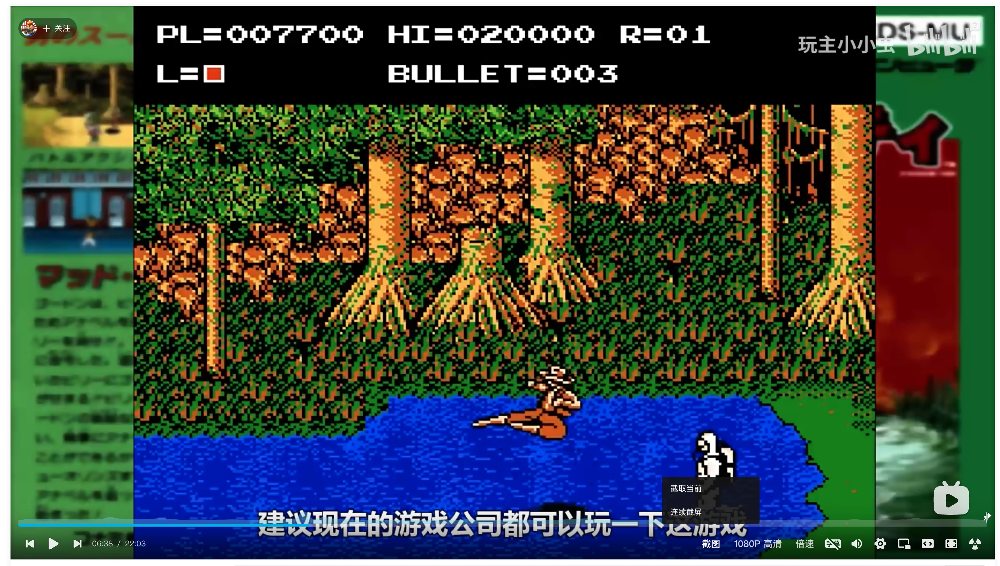
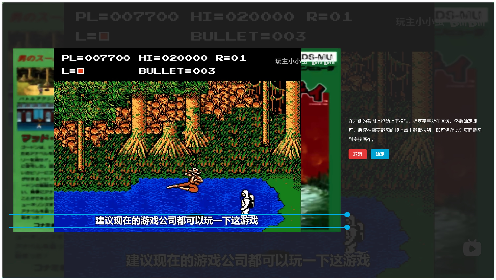
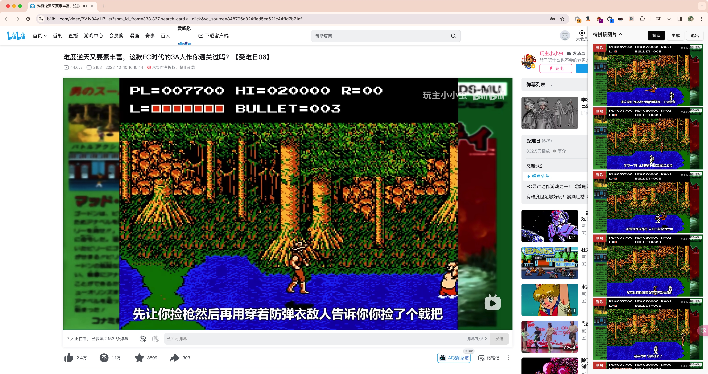
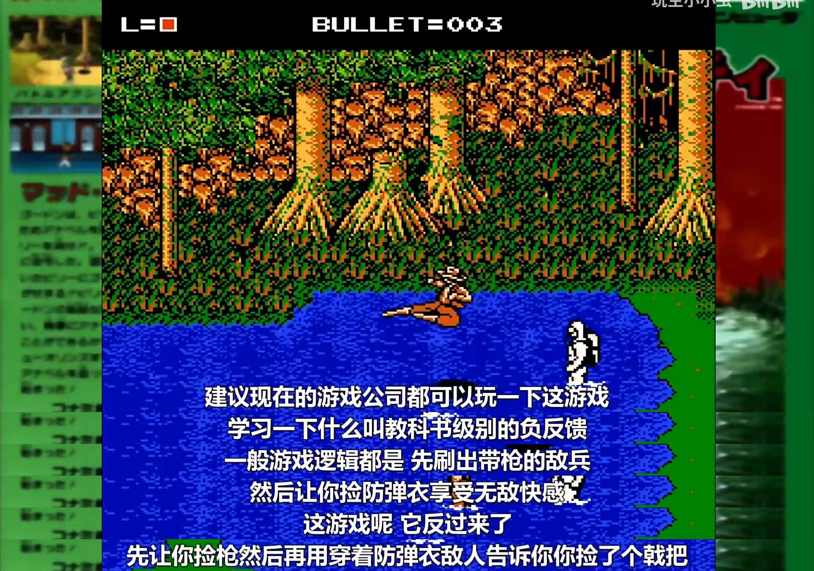

# bili-screenshot-helper (哔哩哔哩截图助手)

Enhance screenshot functionality for the Bilibili website.

## 简介

bili-screenshot-helper 是一个用于增强哔哩哔哩网站的截图功能的工具。

## 特性

- 快速生成当前视频内容的截图。
- 连续点按按钮记录对应时间的屏幕内容。
- 对记录的截图自行拖拽决定拼接顺序
- 拖拽边栏确定字幕所在区域，生成连续字幕的长截图。

## 安装

> 需要浏览器装有 Tampermonkey 或 Violentmonkey 插件，或电脑端安装有 AdGuard 应用

点击安装： [bili-screenshot-helper.user.js](https://unpkg.com/bili-screenshot-helper/dist/bili-screenshot-helper.user.js)。

## 截图

## TODO

- 录制屏幕内容并输出 gif。
- 部分设置项目的持久化存储。

## 致谢

感谢 [SukkaW/bring-github-old-feed-back](https://github.com/SukkaW/bring-github-old-feed-back) 项目，为本项目提供了灵感和参考

## 协议

本项目采用 [GPLv3](https://www.gnu.org/licenses/gpl-3.0.html) 开源协议。
